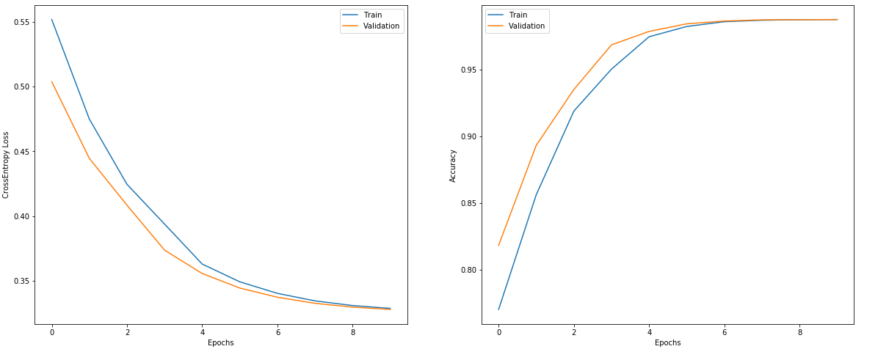
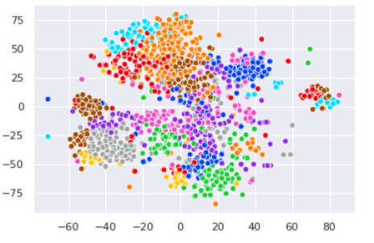

An end to end deep learning model for speaker identification. The model exploits the idea of One-shot learning.

# Requirements
This project assumes that you have the following python modules installed:
- Tensorflow V1.
- Pandas
- pysptk
- hickle

# Training
## Creating features
This model uses MFCCs, their deltas and double deltas as input features. To create these features, run the command
```
python Utils/features.py "path_to_audio_clips" "path_to_train_tsv_file"
```
The above command will create the features and store in path ```features/data/```. 

## Creating the One Shot Dataset
Run the command ```python Utils/datasets.py "path_to_train_tsv_file"```. This will create ```SiameseDataset.npy``` at path ```Utils/```.

## Training the model
Run the command ```python spk_identification.py "path_to_train_tsv_file" "SiameseDataset.npy"```.

## Evaluating the model
Run the command ```python Evaluation.py "path_to_train_tsv_file"```. I trained this model on training set of 2432 voice samples having 28 different speakers. These examples were taken from spanish Common Voice dataset. After training for 10 epochs, both the training and validation accuracy was ~0.97.

## Plots showing model performance


## Embeddings
We plotted the embeddings we got from our testing set of 400 voice samples taken from the trained model. This dataset also had the same 28 speakers. We did tSNE over the embeddings.


## Embeddings
We 

Author: Anurag Kumar


